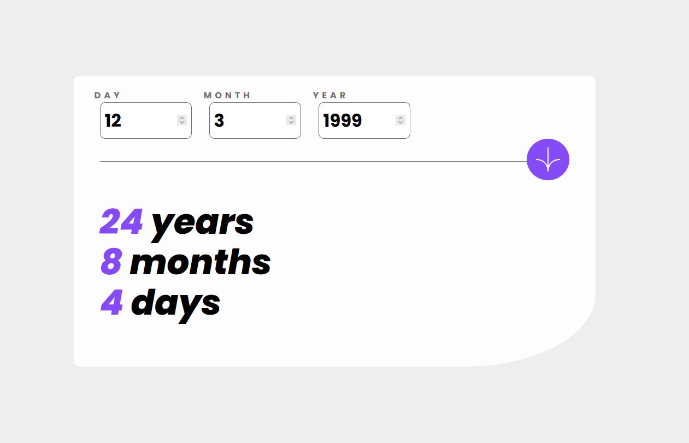

# Frontend Mentor - Age calculator app solution

This is a solution to the [Age calculator app challenge on Frontend Mentor](https://www.frontendmentor.io/challenges/age-calculator-app-dF9DFFpj-Q). Frontend Mentor challenges help you improve your coding skills by building realistic projects.

## Table of contents

- [Overview](#overview)
  - [Screenshot](#screenshot)
  - [Links](#links)
- [My process](#my-process)
  - [Built with](#built-with)
- [Author](#author)
- [Acknowledgments](#acknowledgments)

## Overview

This is my submission for the Frontend Mentor Age Calculator App.

### Screenshot

### Links

- Solution URL: [GitHub](https://github.com/Stefan3002/Frontend-Mentor-Age-Calculator-App)
- Live Site URL: [Web Site](https://stefan3002.github.io/Frontend-Mentor-Age-Calculator-App/)

## My process

### Built with

- Semantic HTML5 markup
- SASS
- JS
- Flexbox
- Desktop-first workflow

## Author

- Website - [Stefan Secrieru](https://dreamy-crisp-8754c8.netlify.app/)
- Frontend Mentor - [Stefan3002](https://www.frontendmentor.io/profile/Stefan3002)
- LinkedIn - [Stefan Secrieru](https://www.linkedin.com/in/%C8%99tefan-secrieru-b0b60b224/)

## Acknowledgments

Credits to 4castle: [Stack Overflow](https://stackoverflow.com/questions/38355157/is-there-a-method-to-convert-miliseconds-to-years-months-days-minutes-seconds-in)
for the math here involved in the conversion of milliseconds to years / days / months.